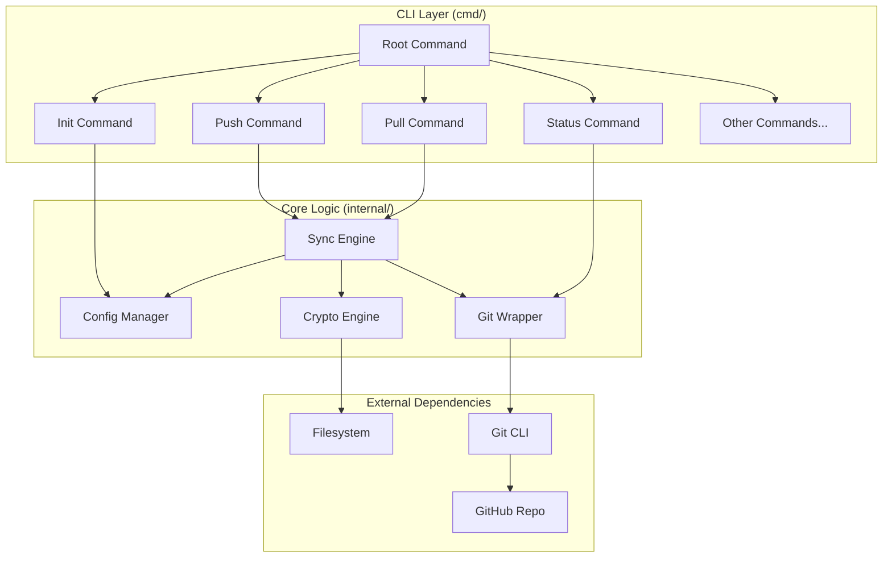
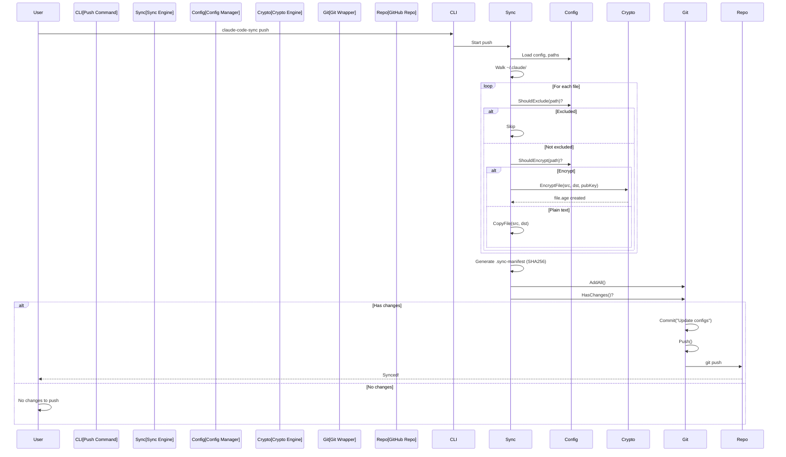
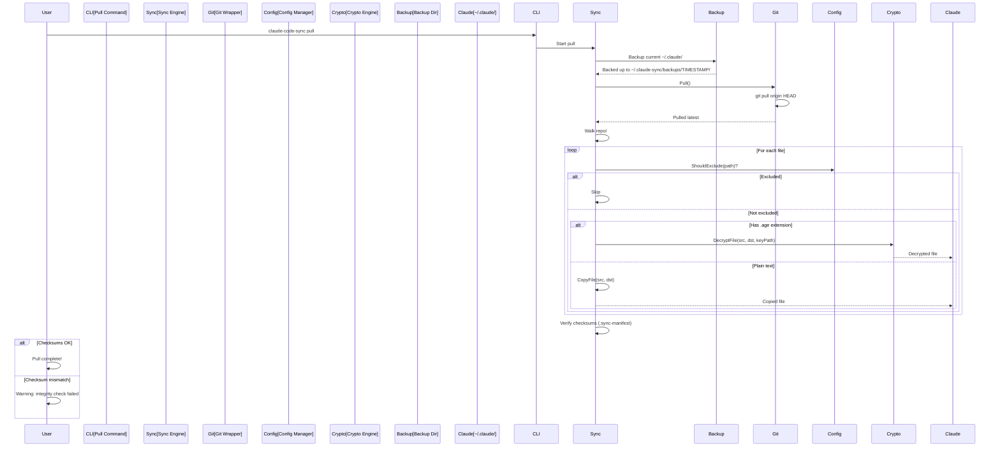

# Architecture

**Technical deep dive into claude-code-sync's design, implementation, and internals.**

---

## Table of Contents

- [Overview](#overview)
- [Design Principles](#design-principles)
- [System Architecture](#system-architecture)
- [Directory Structure](#directory-structure)
- [Core Components](#core-components)
- [Data Flow](#data-flow)
- [Encryption Design](#encryption-design)
- [Pattern Matching](#pattern-matching)
- [Git Integration](#git-integration)
- [Error Handling](#error-handling)
- [Security Considerations](#security-considerations)
- [Performance](#performance)
- [Future Enhancements](#future-enhancements)

---

## Overview

`claude-code-sync` is a cross-platform CLI tool written in Go that syncs Claude Code configurations (`~/.claude/`) across machines using GitHub as a transport layer with selective age encryption.

**Key characteristics:**

- Single binary, no external dependencies except git
- Native age encryption (no shelling out to `age` CLI)
- Selective encryption (plain text for non-sensitive, encrypted for secrets)
- Cross-platform (Windows/macOS/Linux, amd64/arm64)
- Git-based (familiar workflow, version history, distributed)

---

## Design Principles

### 1. **Simplicity**

- Two main operations: `push` and `pull`
- Minimal configuration (sensible defaults)
- Clear, unambiguous error messages

### 2. **Security by Default**

- Sensitive files automatically encrypted
- Private key never leaves the machine
- No plaintext secrets in git repo

### 3. **Explicit Over Implicit**

- Manual sync (no auto-push/pull to avoid accidents)
- Dry-run mode for safety
- Backup before destructive operations

### 4. **Cross-Platform**

- Same binary works on Windows, macOS, Linux
- Path handling (forward slashes in output)
- Platform-specific defaults

### 5. **Fail-Safe**

- Backup before pull
- Integrity verification via checksums
- Git provides rollback capability

---

## System Architecture



### Layers

| Layer | Responsibility | Implementation |
|-------|---------------|----------------|
| **CLI** | User interface, argument parsing | Cobra framework (`cmd/`, `internal/cmd/`) |
| **Core** | Business logic (sync, encrypt, git ops) | Custom packages (`internal/config/`, `internal/crypto/`, `internal/git/`, `internal/sync/`) |
| **External** | File I/O, git CLI, network | OS, git binary |

---

## Directory Structure

### Project Structure

```
claude-code-sync/
├── cmd/claude-code-sync/      # Main entry point
│   └── main.go                # Parses version from ldflags, calls cmd.Execute()
├── internal/                  # Internal packages (not importable)
│   ├── cmd/                   # Cobra command implementations
│   │   ├── root.go            # Root command, version, UI helpers
│   │   ├── init.go            # Initialize sync
│   │   ├── push.go            # Push to GitHub
│   │   ├── pull.go            # Pull from GitHub
│   │   ├── status.go          # Show sync status
│   │   ├── doctor.go          # Health check
│   │   ├── key.go             # import-key, export-key
│   │   ├── verify.go          # Integrity verification
│   │   ├── reset.go           # Reset sync data
│   │   ├── unlink.go          # Disconnect from remote
│   │   ├── version.go         # Show version
│   │   └── update.go          # Check for updates
│   ├── config/                # Configuration management
│   │   └── config.go          # Paths, Config struct, pattern matching
│   ├── crypto/                # Encryption/decryption
│   │   └── age.go             # age key generation, encrypt, decrypt
│   ├── git/                   # Git operations wrapper
│   │   └── git.go             # Git struct, CLI wrappers
│   └── sync/                  # Sync logic
│       └── sync.go            # File walking, copying, backup
├── .github/                   # GitHub Actions
│   └── workflows/
│       ├── ci.yaml            # CI (build, test)
│       └── release.yaml       # Release (goreleaser)
├── .goreleaser.yaml           # goreleaser config
├── go.mod                     # Go module definition
├── go.sum                     # Dependency checksums
├── README.md                  # User documentation
├── CONTRIBUTING.md            # Contributor guide
├── ARCHITECTURE.md            # This file
└── LICENSE                    # MIT license
```

### User Directory Structure

```
~/.claude-sync/                # Sync state directory
├── config                     # Repo URL (plain text)
├── identity.key               # age private key (chmod 600)
├── backups/                   # Automatic backups before pull
│   └── 20250119-143022/
│       └── settings.json
└── repo/                      # Git clone of config repo
    ├── .git/                  # Git internals
    ├── CLAUDE.md              # Plain text
    ├── commands/              # Plain text
    ├── agents/                # Plain text
    ├── skills/                # Mixed (SKILL.md plain, resources/ encrypted)
    ├── settings.json.age      # Encrypted
    ├── settings.local.json.age # Encrypted
    ├── claude.json.age        # Encrypted
    └── .sync-manifest         # SHA256 checksums
```

---

## Core Components

### 1. **Config Manager** (`internal/config/config.go`)

Manages paths, configuration, and pattern matching.

**Key types:**

```go
type Paths struct {
    ClaudeDir  string // ~/.claude
    ClaudeJSON string // ~/.claude.json
    SyncDir    string // ~/.claude-sync
    ConfigFile string // ~/.claude-sync/config.yaml (future)
    KeyFile    string // ~/.claude-sync/identity.key
    RepoDir    string // ~/.claude-sync/repo
    BackupDir  string // ~/.claude-sync/backups
    LockFile   string // ~/.claude-sync/.lock (future)
}

type Config struct {
    EncryptPatterns []string
    ExcludePatterns []string
    Backup          struct {
        MaxCount int
    }
}
```

**Responsibilities:**

- Provide standard paths via `GetPaths()`
- Load config from file (or return defaults)
- Check if a file should be encrypted: `ShouldEncrypt(path)`
- Check if a file should be excluded: `ShouldExclude(path)`

**Pattern matching:**

- Wildcard support (`*.log`, `client_secret_*.json`)
- Directory prefix matching (`plans/` matches `plans/foo/bar.md`)
- Case-insensitive for exclude patterns
- Uses `filepath.Match` for complex patterns

### 2. **Crypto Engine** (`internal/crypto/age.go`)

Handles age key generation, encryption, and decryption using the native Go library.

**Key functions:**

```go
func GenerateKey() (*age.X25519Identity, error)
func GetPublicKey(keyPath string) (string, error)
func LoadIdentity(keyPath string) (*age.X25519Identity, error)
func EncryptFile(src, dst, publicKey string) error
func DecryptFile(src, dst, keyPath string) error
```

**Implementation details:**

- Uses `filippo.io/age` library (no external CLI)
- X25519 key generation (`age.GenerateX25519Identity()`)
- ChaCha20-Poly1305 authenticated encryption
- Streams data (efficient for large files)

**Encryption flow:**

```
Input file → age.Encrypt(publicKey) → Output .age file
```

**Decryption flow:**

```
Input .age file → age.Decrypt(privateKey) → Output file
```

### 3. **Git Wrapper** (`internal/git/git.go`)

Wraps git CLI operations with error handling.

**Key methods:**

```go
type Git struct {
    repoDir string
}

func (g *Git) Init() error
func (g *Git) AddAll() error
func (g *Git) Commit(message string) error
func (g *Git) Push() error
func (g *Git) Pull() error
func (g *Git) HasChanges() (bool, error)
func (g *Git) HasRemote() bool
func (g *Git) AddRemote(name, url string) error
```

**Why shell out instead of using go-git?**

- Simplicity (git CLI is ubiquitous)
- No dependency on complex C libraries
- Users already have git installed
- Easier to debug (same commands users would run)

**Error handling:**

- Captures stderr for meaningful error messages
- Retries pull with `--allow-unrelated-histories` on failure
- URL validation before operations

### 4. **Sync Engine** (`internal/sync/sync.go`)

Orchestrates file operations: walking, copying, encrypting, backing up.

**Key functions:**

```go
func EnsureDir(path string) error
func FileExists(path string) bool
func CopyFile(src, dst string) error
func Backup(src, dst string) error
```

**Responsibilities:**

- Walk `~/.claude/` directory tree
- Check each file against encrypt/exclude patterns
- Copy or encrypt files to repo
- Generate `.sync-manifest` with SHA256 checksums
- Backup before pull
- Restore from backup if needed

---

## Data Flow

### Push Flow



### Pull Flow



---

## Encryption Design

### Age Algorithm

**Why age over GPG?**

| Feature | age | GPG |
|---------|-----|-----|
| **Simplicity** | Single key type (X25519) | Many key types, complex |
| **Modern** | ChaCha20-Poly1305 | Legacy ciphers |
| **Auditability** | Small codebase (~4k LoC) | Large, complex |
| **UX** | Simple API | Arcane CLI flags |
| **Dependencies** | Pure Go | C libraries |

### Key Management

**Key generation:**

```go
identity, err := age.GenerateX25519Identity()
// Returns both private key and public recipient
```

**Key format:**

```
# created: 2025-01-19T14:30:22+08:00
# public key: age1qqxyz...abc
AGE-SECRET-KEY-1XYZ...ABC123
```

**Private key storage:**

- Path: `~/.claude-sync/identity.key`
- Permissions: `chmod 600` (user read/write only)
- Never uploaded to git

**Public key derivation:**

```go
publicKey := identity.Recipient().String()
// age1qqxyz...abc
```

### Encryption Process

```go
func EncryptFile(src, dst, publicKey string) error {
    // 1. Parse public key
    recipient, _ := age.ParseX25519Recipient(publicKey)

    // 2. Open input file
    in, _ := os.Open(src)
    defer in.Close()

    // 3. Create output file
    out, _ := os.Create(dst)
    defer out.Close()

    // 4. Wrap output with age encryptor
    w, _ := age.Encrypt(out, recipient)

    // 5. Stream data
    io.Copy(w, in)

    // 6. Close (writes auth tag)
    w.Close()
}
```

### Decryption Process

```go
func DecryptFile(src, dst, keyPath string) error {
    // 1. Load private key
    identity, _ := LoadIdentity(keyPath)

    // 2. Open encrypted file
    in, _ := os.Open(src)
    defer in.Close()

    // 3. Wrap with age decryptor
    r, _ := age.Decrypt(in, identity)

    // 4. Create output file
    out, _ := os.Create(dst)
    defer out.Close()

    // 5. Stream decrypted data
    io.Copy(out, r)
}
```

### Integrity Verification

**`.sync-manifest` format:**

```
SHA256 (CLAUDE.md) = abc123...
SHA256 (commands/analyze.md) = def456...
SHA256 (settings.json.age) = ghi789...
```

**Generation:**

```go
hash := sha256.New()
io.Copy(hash, file)
checksum := hex.EncodeToString(hash.Sum(nil))
```

**Verification:**

```go
// On pull, recompute checksums
// Compare against .sync-manifest
// Warn if mismatch (corruption or tampering)
```

---

## Pattern Matching

### Encrypt Patterns

Files matching these are encrypted:

```go
DefaultEncryptPatterns = []string{
    "settings.json",
    "settings.local.json",
    "claude.json",
    ".credentials.json",
    "client_secret_*.json",  // Wildcard
    "skills/*/resources/*",   // Path wildcard
}
```

**Matching logic:**

```go
func (c *Config) ShouldEncrypt(relPath string) bool {
    filename := filepath.Base(relPath)
    relPathNorm := filepath.ToSlash(relPath)

    for _, pattern := range c.EncryptPatterns {
        if strings.Contains(pattern, "*") {
            // Wildcard: use filepath.Match
            if matchWildcard(filename, pattern) || matchWildcard(relPathNorm, pattern) {
                return true
            }
        } else {
            // Exact match: filename only
            if filename == pattern {
                return true
            }
        }
    }
    return false
}
```

### Exclude Patterns

Files/folders matching these are never synced:

```go
DefaultExcludePatterns = []string{
    "plans", "projects", "local", "statsig", "todos",
    "plugins/cache", "plugins/marketplaces",
    "history.jsonl", "*.log", "*.tmp", ...
}
```

**Matching logic:**

```go
func (c *Config) ShouldExclude(relPath string) bool {
    filename := filepath.Base(relPath)
    relPathNorm := strings.ToLower(filepath.ToSlash(relPath))

    for _, pattern := range c.ExcludePatterns {
        patternLower := strings.ToLower(pattern)

        if strings.Contains(pattern, "*") {
            // Wildcard: match filename
            if matchWildcard(strings.ToLower(filename), patternLower) {
                return true
            }
        } else {
            // Directory/file name: match prefix or exact
            if relPathNorm == patternLower || strings.HasPrefix(relPathNorm, patternLower+"/") {
                return true
            }
            if strings.ToLower(filename) == patternLower {
                return true
            }
        }
    }
    return false
}
```

---

## Git Integration

### Why Git?

- **Distributed** - No single point of failure
- **Version history** - Full audit trail of changes
- **Familiar** - Developers already know git
- **Ubiquitous** - Works with GitHub, GitLab, Gitea, self-hosted
- **Conflict resolution** - Built-in merge tools

### Git Operations

**Initialize repo:**

```bash
git -C ~/.claude-sync/repo init
```

**Add remote:**

```bash
git -C ~/.claude-sync/repo remote add origin <url>
```

**Stage changes:**

```bash
git -C ~/.claude-sync/repo add -A
```

**Commit:**

```bash
git -C ~/.claude-sync/repo commit -m "Update configs"
```

**Push:**

```bash
git -C ~/.claude-sync/repo push origin HEAD
```

**Pull:**

```bash
git -C ~/.claude-sync/repo pull origin HEAD
# If fails with "unrelated histories":
git -C ~/.claude-sync/repo pull origin HEAD --allow-unrelated-histories
```

### Conflict Handling

**On push:**

- Check if remote has changes: `git fetch && git status`
- If remote ahead: warn user to `pull` first
- User resolves conflicts manually

**On pull:**

- Backup current `~/.claude/` to `~/.claude-sync/backups/TIMESTAMP/`
- Pull from remote (overwrites repo)
- If local file differs from pulled file:
  - Save local as `filename.local-backup-TIMESTAMP`
  - Apply remote version
  - User can manually diff/merge

---

## Error Handling

### Principles

1. **Explicit errors** - Return errors up the stack, don't panic
2. **Context** - Wrap errors with `fmt.Errorf("context: %w", err)`
3. **User-friendly** - Print clear, actionable error messages
4. **Fail-fast** - Don't continue if critical operation fails

### Error Propagation

```go
func push() error {
    cfg, err := config.Load(paths.ConfigFile)
    if err != nil {
        return fmt.Errorf("failed to load config: %w", err)
    }

    if err := syncToDisk(cfg); err != nil {
        return fmt.Errorf("sync failed: %w", err)
    }

    if err := git.Push(); err != nil {
        return fmt.Errorf("git push failed: %w", err)
    }

    return nil
}
```

### Error Presentation

```go
if err := runPush(cmd, args); err != nil {
    logError(err.Error())  // Colored error message
    return err             // Non-zero exit code
}
```

### Common Errors

| Error | Cause | Solution |
|-------|-------|----------|
| `git is not installed` | Git not in PATH | Install git |
| `failed to clone: repository not found` | Invalid repo URL or no access | Check URL, SSH keys |
| `failed to decrypt: age: no identity matched` | Wrong private key | Import correct key |
| `unrelated histories` | Repos diverged | Auto-retries with `--allow-unrelated-histories` |

---

## Security Considerations

### Threat Model

**In scope:**

- ✅ Repo compromise (encrypted files unreadable)
- ✅ Transport interception (git SSH/HTTPS)
- ✅ Accidental commits (patterns prevent plaintext secrets)

**Out of scope:**

- ⚠️ Key theft (user responsible for key security)
- ⚠️ Local machine compromise (attacker has filesystem access)
- ⚠️ Side-channel attacks (not a concern for this use case)

### Defense in Depth

1. **Private GitHub repo** - Even though secrets encrypted
2. **age encryption** - Industry-standard algorithm
3. **Key permissions** - `chmod 600` on identity.key
4. **Integrity checks** - SHA256 manifest detects tampering
5. **Backups** - Before destructive operations

### Attack Scenarios

**Scenario 1: Attacker gains read access to GitHub repo**

- Encrypted files are safe (unreadable without private key)
- Plain text files (commands, agents) are readable (non-sensitive by design)

**Scenario 2: Attacker steals private key**

- Can decrypt encrypted files
- **Mitigation:** Use different keys for personal vs work, rotate if compromised

**Scenario 3: Attacker modifies files in repo**

- Integrity check (`.sync-manifest`) detects tampering
- Git history shows who made changes

---

## Performance

### Optimization Strategies

1. **Streaming I/O** - age encryption streams data (no full file in memory)
2. **Minimal git ops** - Only push if changes detected (`git diff --quiet`)
3. **Selective processing** - Skip excluded files early (don't even read)

### Benchmarks

> TODO: Add benchmarks for:
> - Large repos (1000+ files)
> - Large files (100MB+ skill resources)
> - Encryption/decryption speed

### Bottlenecks

| Operation | Bottleneck | Impact |
|-----------|-----------|--------|
| **Push** | Git push (network) | Proportional to repo size |
| **Pull** | Git pull (network) | Proportional to repo size |
| **Encryption** | CPU (ChaCha20) | Fast (~GB/s on modern CPUs) |
| **Decryption** | CPU | Fast |

---

## Future Enhancements

### Planned Features

1. **Custom patterns** - User-defined encrypt/exclude patterns in `~/.claude-sync/config.yaml`
2. **Multi-key encryption** - Encrypt for multiple recipients (team sharing)
3. **Compression** - Compress before encrypting (reduce repo size)
4. **Partial sync** - Only sync specific folders (`--only commands`)
5. **Diff view** - Show file diffs before push/pull
6. **Auto-update** - Self-update mechanism
7. **Hooks** - Pre-push/post-pull hooks for custom scripts
8. **Lock file** - Prevent concurrent push/pull operations

### Technical Debt

- [ ] Increase test coverage (currently minimal)
- [ ] Add integration tests with real git repos
- [ ] Mock git operations for unit tests
- [ ] Add benchmarks
- [ ] Improve error messages (more context)
- [ ] Add progress indicators for long operations
- [ ] Support for `go-git` library (optional, for environments without git CLI)

### Non-Goals

- **General-purpose sync tool** - Stay focused on Claude Code configs
- **Real-time sync** - Manual push/pull is intentional
- **GUI** - CLI-first tool
- **Auto-conflict resolution** - User should resolve conflicts manually

---

## References

- [age specification](https://github.com/C2SP/C2SP/blob/main/age.md)
- [filippo.io/age Go library](https://pkg.go.dev/filippo.io/age)
- [Cobra CLI framework](https://github.com/spf13/cobra)
- [Claude Code documentation](https://code.claude.com/docs)
- [Semantic Versioning](https://semver.org/)

---

## Contributors

See [CONTRIBUTING.md](CONTRIBUTING.md) for contribution guidelines.
