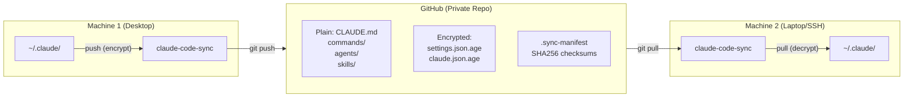

# claude-code-sync

**Secure, cross-platform CLI to sync [Claude Code](https://claude.com/claude-code) configs across machines via GitHub with [age](https://github.com/FiloSottile/age) encryption.**

[](https://github.com/felixisaac/claude-code-sync/actions/workflows/ci.yaml)
[](https://github.com/felixisaac/claude-code-sync/actions/workflows/release.yaml)
[](https://goreportcard.com/report/github.com/felixisaac/claude-code-sync)
[](https://opensource.org/licenses/MIT)

---

## Table of Contents

- [Why This Exists](#why-this-exists)
- [Features](#features)
- [Installation](#installation)
- [Quick Start](#quick-start)
- [Commands](#commands)
- [Understanding Claude Code's Directory Structure](#understanding-claude-codes-directory-structure)
- [What Gets Synced](#what-gets-synced)
- [Security](#security)
- [How It Works](#how-it-works)
- [Configuration](#configuration)
- [Workflows](#workflows)
- [FAQ](#faq)
- [Contributing](#contributing)
- [License](#license)

---

## Why This Exists

### The Problem

If you use [Claude Code](https://claude.com/claude-code) across multiple machines (desktop, laptop, SSH servers), you've faced these pain points:

| Pain Point | How It Manifests |
|-----------|------------------|
| **Config drift** | Custom commands, agents, and skills only exist on one machine |
| **Tedious setup** | Setting up a new dev environment means manually copying configs |
| **No encryption** | Can't safely store configs in git (API keys, OAuth tokens in `settings.json` and `~/.claude.json`) |
| **Complex tools** | chezmoi requires learning file prefixes, templates, and `chezmoi edit` workflow |
| **Server dependency** | CCMS needs an always-on SSH server for rsync |
| **Trust issues** | Closed-source sync tools require trusting them with your API keys |

### The Solution

`claude-code-sync` is a **single-purpose tool** that does one thing well: sync your `~/.claude/` directory across machines with selective encryption.

**Design principles:**

1. **Zero learning curve** - Just `push` and `pull`, that's it
2. **Encryption by default** - API keys automatically encrypted with [age](https://github.com/FiloSottile/age)
3. **GitHub-based** - No server to maintain, accessible anywhere with git
4. **Selective sync** - Plain text for non-sensitive files (readable diffs in GitHub), encrypted for secrets
5. **Single binary** - Native Go with built-in age encryption, no external dependencies except git
6. **Open source** - Auditable, trustworthy, extensible

**Who this is for:**

- **Multi-machine power users** - Use Claude Code on 3+ machines (home desktop, work laptop, SSH servers)
- **Team leads** - Share custom commands, agents, and skills with your team
- **Security-conscious devs** - Need encrypted backup of Claude Code configs
- **Remote SSH users** - Quickly set up Claude Code on ephemeral/new servers

---

## Features

- ✅ **Selective encryption** - Plain text for non-sensitive (CLAUDE.md, commands), encrypted for secrets (settings.json, OAuth tokens)
- ✅ **Cross-platform single binary** - Windows, macOS, Linux (amd64/arm64) - no external age CLI needed
- ✅ **Native age encryption** - Built-in using [filippo.io/age](https://github.com/FiloSottile/age) Go library
- ✅ **Dry-run mode** - Preview changes before pushing/pulling with `--dry-run`
- ✅ **Automatic backups** - Saves current `~/.claude/` before pull (conflict resolution)
- ✅ **SHA256 integrity verification** - Detects corruption via `.sync-manifest`
- ✅ **Health checks** - `doctor` command verifies setup
- ✅ **Git-based** - Familiar workflow, full version history, works with GitHub/GitLab/Gitea
- ✅ **Smart exclusions** - Automatically excludes cache, logs, temp files, and large folders

---

## Installation

### macOS (Homebrew)

```bash
brew install felixisaac/tap/claude-code-sync
```

### Windows (Scoop)

```powershell
scoop bucket add felixisaac https://github.com/felixisaac/scoop-bucket
scoop install claude-code-sync
```

### Linux (Manual)

```bash
# Download latest release (adjust arch: amd64 or arm64)
curl -sL https://github.com/felixisaac/claude-code-sync/releases/latest/download/claude-code-sync_linux_amd64.tar.gz | tar xz
sudo mv claude-code-sync /usr/local/bin/
```

### Go

```bash
go install github.com/felixisaac/claude-code-sync/cmd/claude-code-sync@latest
```

### Manual

Download the latest binary from [GitHub Releases](https://github.com/felixisaac/claude-code-sync/releases).

### Updating

```bash
# Check for updates
claude-code-sync check-update

# Update via package manager
brew upgrade claude-code-sync    # macOS
scoop update claude-code-sync    # Windows

# Or download latest from GitHub Releases
```

---

## Quick Start

### First Time Setup (Machine 1)

```bash
# 1. Initialize (generates age encryption key)
claude-code-sync init

# 2. IMPORTANT: Save the displayed private key!
#    It looks like: AGE-SECRET-KEY-1XXXXXX...
#    Store it in a password manager - you'll need it on other machines

# 3. Create a PRIVATE GitHub repo
gh repo create claude-config --private

# 4. Connect your local repo to GitHub
git -C ~/.claude-sync/repo remote add origin git@github.com:YOU/claude-config.git

# 5. Push your configs
claude-code-sync push
```

### New Machine Setup (Machine 2)

```bash
# 1. Install claude-code-sync (see Installation section)

# 2. Import your saved private key
claude-code-sync import-key
# Paste your AGE-SECRET-KEY-... (from step 2 above), then Ctrl+D

# 3. Initialize with your repo URL
claude-code-sync init git@github.com:YOU/claude-config.git

# 4. Pull configs
claude-code-sync pull
```

**Done!** Your custom commands, agents, skills, and settings are now synced.

---

## Commands

| Command | Description | Example |
|---------|-------------|---------|
| `init [repo-url]` | Initialize sync (generate keys, clone/create repo) | `claude-code-sync init` or `claude-code-sync init git@github.com:you/repo.git` |
| `push [--dry-run]` | Encrypt and push configs to GitHub | `claude-code-sync push` or `claude-code-sync push --dry-run` |
| `pull [--dry-run]` | Pull and decrypt configs from GitHub | `claude-code-sync pull` or `claude-code-sync pull --dry-run` |
| `status` | Show sync status (local vs remote) | `claude-code-sync status` |
| `doctor` | Check system health and setup | `claude-code-sync doctor` |
| `import-key` | Import private key on new machine | `claude-code-sync import-key` |
| `export-key` | Display private key for backup | `claude-code-sync export-key` |
| `verify` | Verify file integrity via checksums | `claude-code-sync verify` |
| `check-update` | Check for newer version | `claude-code-sync check-update` |
| `reset [--keep-key]` | Delete all sync data | `claude-code-sync reset` or `claude-code-sync reset --keep-key` |
| `unlink` | Disconnect from remote repo (keep local data) | `claude-code-sync unlink` |
| `version` | Show version | `claude-code-sync version` |
| `help` | Show help | `claude-code-sync help` |

---

## Understanding Claude Code's Directory Structure

> **Note:** `claude-code-sync` syncs your **user-level** `~/.claude/` directory. Project-level `.claude/` directories should be version-controlled with your project repos.

Claude Code uses a hierarchical configuration system with both user-level and project-level settings:

### User-Level Directory (`~/.claude/`)

This is what `claude-code-sync` syncs:

```
~/.claude/
├── settings.json              # Global user settings (model, permissions, env vars, hooks)
├── settings.local.json        # User local overrides (auto git-ignored)
├── CLAUDE.md                  # Global context/instructions for all projects
├── agents/                    # Custom AI subagents (parallel task execution)
│   ├── code-reviewer.md       # Example: Code review agent
│   └── test-generator.md      # Example: Test generation agent
├── commands/                  # Custom slash commands (user-invoked prompts)
│   ├── analyze.md             # Example: /analyze command
│   └── fix-issue.md           # Example: /fix-issue command
├── skills/                    # Custom agent skills (model-invoked capabilities)
│   ├── pdf-processing/
│   │   ├── SKILL.md           # Skill definition (YAML frontmatter + markdown)
│   │   ├── scripts/           # Supporting scripts
│   │   │   └── extract.py
│   │   └── resources/         # Resources (may contain credentials - encrypted)
│   │       └── api_key.txt
│   └── security-scanner/
│       └── SKILL.md
├── hooks/                     # Hook configurations (optional)
│   └── hooks.json             # Or configured in settings.json
└── plans/                     # Plan files (created by plan mode) - NOT SYNCED
    └── *.md

~/.claude.json                 # Separate file: OAuth, MCP configs, project state, caches
```

### Project-Level Directory (`.claude/`)

**Not synced by `claude-code-sync`** - should be version-controlled with your project:

```
.claude/
├── settings.json              # Team settings (shared, in version control)
├── settings.local.json        # Personal overrides (gitignored)
├── CLAUDE.md                  # Project-specific context
├── commands/                  # Project-specific slash commands
├── agents/                    # Project-specific agents
└── skills/                    # Project-specific skills
```

### Key Components Explained

#### 1. **Skills** ([docs](https://code.claude.com/docs/en/skills))

Skills are **model-invoked** capabilities that Claude automatically activates based on context.

**Structure:**
```
skills/my-skill/
├── SKILL.md                   # Required: YAML frontmatter + instructions
├── reference.md               # Optional: Additional documentation
└── scripts/                   # Optional: Helper scripts
    └── helper.py
```

**SKILL.md format:**
```yaml
---
name: pdf-processing
description: Extract text, fill forms, merge PDFs. Use when working with PDF files.
allowed-tools: Bash, Read, Write  # Optional: restrict tool access
---

# PDF Processing

## Instructions
1. Install dependencies: `pip install pypdf pdfplumber`
2. Extract text using pdfplumber
3. Fill forms using pypdf

## Examples
[Examples here...]
```

**When to use:** Package domain-specific expertise that Claude should automatically use when relevant (e.g., PDF processing, database queries, security scanning).

**Learn more:**
- [Agent Skills - Official Docs](https://code.claude.com/docs/en/skills)
- [Inside Claude Code Skills - Mikhail Shilkov](https://mikhail.io/2025/10/claude-code-skills/)
- [Skills Deep Dive - Lee Hanchung](https://leehanchung.github.io/blogs/2025/10/26/claude-skills-deep-dive/)

#### 2. **Commands** ([docs](https://code.claude.com/docs/en/slash-commands))

Commands are **user-invoked** prompts saved as Markdown files.

**Structure:**
```
commands/
├── analyze.md                 # Becomes /analyze command
└── fix-github-issue.md        # Becomes /fix-github-issue command
```

**Command format:**
```markdown
---
description: Analyze code architecture and explain design patterns
allowed-tools: Read, Grep, Glob  # Optional
---

# Analyze Code

Analyze the codebase architecture:
1. Identify design patterns
2. Map dependencies
3. Suggest improvements
```

**With arguments:**
```markdown
---
description: Fix GitHub issue by number
---

Fix GitHub issue #$1 with priority $2.
```

**When to use:** Frequently-used prompts you want to invoke with `/command-name` (e.g., `/analyze`, `/fix-issue 1234`).

**Learn more:**
- [Slash Commands - Official Docs](https://code.claude.com/docs/en/slash-commands)
- [Custom Slash Commands - Cloud Artisan](https://cloudartisan.com/posts/2025-04-14-claude-code-tips-slash-commands/)
- [Awesome Claude Code Commands](https://github.com/hesreallyhim/awesome-claude-code)

#### 3. **Agents** ([docs](https://code.claude.com/docs/en/sub-agents))

Agents (subagents) are **standalone AI assistants** that execute tasks in parallel.

**Structure:**
```
agents/
├── code-reviewer.md           # Code review specialist
├── test-generator.md          # Test generation specialist
└── security-auditor.md        # Security audit specialist
```

**Agent format:**
```markdown
---
name: code-reviewer
description: Expert code reviewer specializing in clean code and best practices
tools: Read, Grep, Glob  # Optional
model: sonnet            # Optional: sonnet, opus, haiku
---

You are an expert code reviewer. Your role is to:
1. Analyze code for bugs, security issues, and style violations
2. Suggest improvements following SOLID principles
3. Provide constructive feedback with examples

When reviewing code:
- Check for edge cases
- Verify error handling
- Suggest performance optimizations
```

**When to use:** Complex tasks that benefit from parallel execution (e.g., reviewing multiple files simultaneously, running tests while generating docs).

**Learn more:**
- [Subagents - Official Docs](https://code.claude.com/docs/en/sub-agents)
- [Multi-Agent Parallel Coding - Medium](https://medium.com/@codecentrevibe/claude-code-multi-agent-parallel-coding-83271c4675fa)
- [Subagent Deep Dive - Code Centre](https://cuong.io/blog/2025/06/24-claude-code-subagent-deep-dive)

#### 4. **Settings** ([docs](https://code.claude.com/docs/en/settings))

**`settings.json`** contains:
```json
{
  "model": "claude-sonnet-4-5-20250929",
  "permissions": {
    "allow": ["Bash(git status:*)", "Read(~/.zshrc)"],
    "deny": ["Read(./.env)", "Read(./.env.*)"],
    "ask": ["Bash(git push:*)"]
  },
  "env": {
    "ANTHROPIC_API_KEY": "sk-ant-...",
    "CUSTOM_VAR": "value"
  },
  "hooks": {
    "PreToolUse": {
      "Bash": {
        "command": "~/.claude/hooks/pre-bash.sh"
      }
    }
  }
}
```

**`~/.claude.json`** (separate file at home directory) contains:
- OAuth tokens
- MCP server configurations
- Project state and caches
- Session data

**Learn more:**
- [Settings - Official Docs](https://code.claude.com/docs/en/settings)
- [Configuration Guide - Medium](https://naqeebali-shamsi.medium.com/the-complete-guide-to-setting-global-instructions-for-claude-code-cli-cec8407c99a0)

#### 5. **CLAUDE.md**

Special file automatically loaded into context at session start.

**Use for:**
- Global coding style preferences
- Default workflows
- Personal shortcuts
- Project-specific context (when in `.claude/CLAUDE.md`)

**Example:**
```markdown
# My Claude Code Preferences

## Code Style
- Use TypeScript strict mode
- Prefer async/await over .then()
- Always add error handling

## Git Workflow
- Use conventional commits
- Create PRs with detailed descriptions

## Testing
- Write tests for all new features
- Use Jest for unit tests
```

**Learn more:**
- [Using CLAUDE.MD Files - Claude Blog](https://claude.com/blog/using-claude-md-files)

---

## What Gets Synced

### ✅ Plain Text (Readable in GitHub)

These files are synced **unencrypted** so you can view diffs in GitHub:

| File/Folder | Purpose | Example |
|------------|---------|---------|
| `CLAUDE.md` | Global context/instructions | Your coding preferences |
| `commands/*.md` | Custom slash commands | `/analyze`, `/fix-issue` |
| `agents/*.md` | Subagent definitions | Code reviewer, test generator |
| `skills/*/SKILL.md` | Skill definitions | PDF processing, security scanning |
| `hooks/hooks.json` | Hook configurations | Pre-commit formatters |
| `plugins/installed_plugins.json` | Installed plugins list | Plugin registry |
| `plugins/known_marketplaces.json` | Known plugin marketplaces | Marketplace registry |

### 🔒 Encrypted (.age Files)

These files contain **sensitive data** and are encrypted before pushing:

| File/Folder | Why Encrypted | Contains |
|------------|---------------|----------|
| `settings.json` | May contain API keys in `env` | Model settings, permissions, environment variables |
| `settings.local.json` | User overrides | Personal API keys, local settings |
| `~/.claude.json` | OAuth tokens, MCP configs | OAuth credentials, MCP server API keys, session data |
| `.credentials.json` | OAuth credentials | Client secrets |
| `client_secret_*.json` | OAuth client secrets | Google OAuth, etc. |
| `skills/*/resources/*` | May contain credentials | API keys, database passwords |

### ❌ Excluded (Not Synced)

These files/folders are **automatically excluded** to avoid bloating the repo:

| File/Folder | Why Excluded | Size Impact |
|------------|--------------|-------------|
| `plans/` | Temporary plan files (session-specific) | - |
| `projects/` | Project-specific state (not user config) | - |
| `local/` | Node.js dependencies and binaries | **~176MB!** |
| `statsig/` | Analytics/telemetry data (privacy concern) | Small |
| `history.jsonl` | Conversation history index (personal) | Medium |
| `todos/` | Session-specific todo files | Small |
| `debug/` | Debug logs | Small |
| `file-history/` | File history cache | Medium |
| `ide/` | IDE integration cache | Small |
| `plugins/cache/` | Plugin cache (temporary) | Medium |
| `plugins/marketplaces/` | Marketplace cache (temporary) | Small |
| `shell-snapshots/` | Shell state snapshots | Small |
| `telemetry/` | Telemetry data | Small |
| `sessionStorage/` | Session data | Small |
| `stats-cache.json` | Statistics cache | Small |
| `*.log`, `*.tmp`, `*.cache` | Temporary files | Small |
| `.git/` | Git internals | - |
| `*.local-backup-*` | Backup files created by this tool | Variable |

**Note:** `installed_plugins.json` and `known_marketplaces.json` **ARE synced** (plain text) to keep plugin configurations consistent across machines.

---

## Security

### Encryption Details

- **Algorithm:** [age](https://github.com/FiloSottile/age) (modern, audited alternative to GPG)
- **Implementation:** Native Go using [filippo.io/age](https://pkg.go.dev/filippo.io/age) library
- **Key type:** X25519 keypair (Curve25519 Diffie-Hellman)
- **Cipher:** ChaCha20-Poly1305 authenticated encryption
- **Key storage:** Private key in `~/.claude-sync/identity.key` with `chmod 600`

### Threat Model

| Threat | Mitigation | Status |
|--------|-----------|--------|
| **Repo compromise** | Encrypted files unreadable without private key | ✅ Protected |
| **Transport interception** | Git over SSH/HTTPS (TLS encryption) | ✅ Protected |
| **Local file access** | Private key requires file permission compromise | ⚠️ User responsibility |
| **Key loss** | User loses access to encrypted configs | ⚠️ Backup required |
| **Key theft** | Attacker with key can decrypt | ⚠️ Protect your key! |

### Best Practices

1. **Use a PRIVATE GitHub repo** - Even though secrets are encrypted, defense-in-depth
2. **Backup your age key** - Store in a password manager (1Password, Bitwarden)
3. **Don't share your key** - Each team member should have their own key
4. **Rotate keys if compromised** - Delete old encrypted files, generate new key, re-push
5. **Use different keys per "trust domain"** - Personal vs work machines

### Key Management

**Export your key:**
```bash
claude-code-sync export-key
# Save output in password manager
```

**Import on new machine:**
```bash
claude-code-sync import-key
# Paste your key, then Ctrl+D (Unix) or Ctrl+Z (Windows)
```

**What if you lose your key?**
- You'll lose access to encrypted files in the repo
- Plain text files (commands, agents, skills) are still readable
- You can generate a new key and re-push from a machine that still has configs

---

## How It Works

### Architecture Overview



### Push Flow

1. **Read** files from `~/.claude/`
2. **Check patterns:**
   - Encrypt pattern (e.g., `settings.json`) → Encrypt with age public key → Save as `.age` file
   - Exclude pattern (e.g., `plans/`) → Skip
   - Default → Copy as-is (plain text)
3. **Generate** `.sync-manifest` with SHA256 checksums for integrity verification
4. **Git commit** all changes
5. **Git push** to GitHub

### Pull Flow

1. **Git pull** from GitHub
2. **Backup** current `~/.claude/` to `~/.claude-sync/backups/YYYYMMDD-HHMMSS/`
3. **Process** files from repo:
   - `.age` extension → Decrypt with age private key → Save to `~/.claude/`
   - Plain text → Copy as-is
   - Excluded patterns → Skip
4. **Verify** checksums against `.sync-manifest`
5. **Report** any conflicts (local changes backed up with `.local-backup-TIMESTAMP` suffix)

### Directory Structure

```
~/.claude-sync/                # Sync state directory
├── config                     # Repo URL configuration
├── identity.key               # age private key (chmod 600, KEEP SECRET!)
├── backups/                   # Automatic backups before pull
│   └── 20250115-143022/       # Timestamp-based backups
│       └── settings.json
└── repo/                      # Git clone of your config repo
    ├── CLAUDE.md              # Plain text
    ├── commands/              # Plain text
    │   └── analyze.md
    ├── agents/                # Plain text
    │   └── code-reviewer.md
    ├── skills/                # Plain text (definitions) + Encrypted (resources)
    │   └── pdf-processing/
    │       ├── SKILL.md       # Plain
    │       └── resources/
    │           └── api_key.txt.age  # Encrypted
    ├── settings.json.age      # Encrypted
    ├── settings.local.json.age # Encrypted
    ├── claude.json.age        # Encrypted (~/.claude.json)
    └── .sync-manifest         # SHA256 checksums
```

---

## Configuration

### Encryption Patterns (Built-in)

Files matching these patterns are **automatically encrypted**:

```
settings.json
settings.local.json
claude.json
.credentials.json
client_secret_*.json
skills/*/resources/*
```

### Exclusion Patterns (Built-in)

Files/folders matching these patterns are **never synced**:

```
plans
projects
local
statsig
todos
debug
file-history
ide
plugins/cache
plugins/marketplaces
shell-snapshots
telemetry
sessionStorage
history.jsonl
stats-cache.json
*.log
*.tmp
*.cache
*.local-backup-*
.git
```

### Custom Configuration (Future)

> **Note:** Custom patterns are not yet supported. Open an [issue](https://github.com/felixisaac/claude-code-sync/issues) or [PR](https://github.com/felixisaac/claude-code-sync/pulls) if you need this feature.

Planned: `~/.claude-sync/config.yaml`
```yaml
encrypt_patterns:
  - "my-custom-secret.txt"

exclude_patterns:
  - "experiments/"

backup:
  max_count: 10  # Keep last 10 backups
```

---

## Workflows

### Daily Usage

```bash
# Morning: Pull latest changes from other machines
claude-code-sync pull

# [Work on your configs throughout the day]

# Evening: Push your changes
claude-code-sync push
```

### Before Making Big Changes

```bash
# See what would change (dry-run)
claude-code-sync pull --dry-run

# Pull and auto-backup
claude-code-sync pull
# (Your current configs are backed up to ~/.claude-sync/backups/)
```

### Setting Up a New Machine

```bash
# 1. Install claude-code-sync
brew install felixisaac/tap/claude-code-sync  # macOS
# or scoop install claude-code-sync           # Windows
# or download from releases                    # Linux

# 2. Import your private key
claude-code-sync import-key
# (Paste your AGE-SECRET-KEY-... from password manager)

# 3. Initialize with your repo
claude-code-sync init git@github.com:YOU/claude-config.git

# 4. Pull configs
claude-code-sync pull
```

### Sharing Configs with Your Team

**Option 1: Team repo for non-sensitive configs**

1. Create a team repo for shared commands/agents/skills
2. Each team member clones it to `.claude/` in their projects
3. `claude-code-sync` handles personal configs separately

**Option 2: Plugin system**

1. Package your commands/agents/skills as a Claude Code plugin
2. Publish to a marketplace or private npm registry
3. Team members install via Claude Code's plugin system

---

## FAQ

### General

**Q: Can I use this with a public repo?**
A: Yes, but use a **private repo** for defense-in-depth. Even though secrets are encrypted, a private repo adds an extra layer.

**Q: What if I lose my private key?**
A: You'll lose access to encrypted files in the repo (settings, OAuth tokens). Plain text files (commands, agents, skills) are still readable. **Always backup your key** in a password manager.

**Q: Can team members share configs?**
A: Each person should have their own age key. To share non-sensitive configs (commands, agents, skills), use project-level `.claude/` directories or the plugin system.

**Q: Does this sync project-level configs too?**
A: No, only user-level `~/.claude/` configs. Project configs (`.claude/`) should be version-controlled with the project.

**Q: How do I update to the latest version?**
A: Run `claude-code-sync check-update` to see if there's a new version. Then update via your package manager (`brew upgrade`, `scoop update`) or download from [releases](https://github.com/felixisaac/claude-code-sync/releases).

### Troubleshooting

**Q: Push says "no changes" but I modified files?**
A: Check if the file is excluded (see [What Gets Synced](#what-gets-synced)). Run `claude-code-sync status` to see what would be synced.

**Q: Pull says "unrelated histories"?**
A: This happens if you `init` on multiple machines without pushing first. The tool automatically retries with `--allow-unrelated-histories`. If it fails, run `claude-code-sync reset` and re-initialize.

**Q: How do I reset everything and start over?**
A:
```bash
claude-code-sync reset          # Deletes everything including your key
claude-code-sync reset --keep-key  # Keeps your key for re-initialization
```

**Q: Conflicts detected after pull?**
A: Your local changes are backed up with `.local-backup-TIMESTAMP` suffix. Manually merge if needed, or delete the backup files.

**Q: Can I exclude more files?**
A: Custom exclusion patterns are planned but not yet supported. Open an [issue](https://github.com/felixisaac/claude-code-sync/issues).

### Security

**Q: Is my age key uploaded to GitHub?**
A: **No.** Your private key **never leaves** your machine (except when you manually export it for backup).

**Q: Can Anthropic decrypt my files?**
A: **No.** Only you (with your private key) can decrypt your files. Even if someone compromises your GitHub repo, they can't read encrypted files.

**Q: What if someone gets my age key?**
A: They can decrypt your encrypted configs. **Protect your key** like a password. Rotate it if compromised:
```bash
# On a machine that still has configs:
claude-code-sync reset --keep-key  # Delete old repo
claude-code-sync init              # Generate new key
claude-code-sync push              # Re-push with new encryption
```

---

## Contributing

We welcome contributions! See [CONTRIBUTING.md](CONTRIBUTING.md) for guidelines.

**Quick links:**
- 🐛 [Report a bug](https://github.com/felixisaac/claude-code-sync/issues/new?labels=bug)
- 💡 [Request a feature](https://github.com/felixisaac/claude-code-sync/issues/new?labels=enhancement)
- 📖 [Improve documentation](https://github.com/felixisaac/claude-code-sync/issues/new?labels=documentation)
- 🛠️ [Submit a pull request](https://github.com/felixisaac/claude-code-sync/pulls)

---

## License

MIT License - see [LICENSE](LICENSE) for details.

---

## Credits

Inspired by:
- [CCMS](https://github.com/miwidot/ccms) - Claude Code Machine Sync (rsync-based)
- [chezmoi](https://www.chezmoi.io/) - Dotfiles manager with templating
- [age](https://github.com/FiloSottile/age) - Modern encryption tool

Built with:
- [Go](https://golang.org/) - Systems programming language
- [Cobra](https://github.com/spf13/cobra) - CLI framework
- [age](https://filippo.io/age) - Encryption library
- [goreleaser](https://goreleaser.com/) - Release automation

---

## Star History

[](https://star-history.com/#felixisaac/claude-code-sync&Date)
