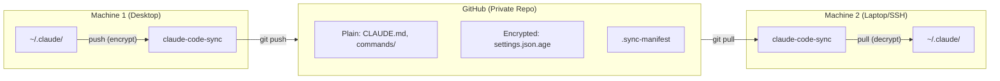

# claude-code-sync

Secure cross-platform CLI to sync [Claude Code](https://claude.com/claude-code) configs (`~/.claude/`) across machines via GitHub with [age](https://github.com/FiloSottile/age) encryption.

## Why?

- **Multi-machine developers**: Keep your custom commands, agents, skills, and settings in sync across desktop, laptop, and SSH servers
- **Security**: API keys and OAuth tokens are encrypted with age before pushing to GitHub
- **Simple**: Just `push` and `pull` - no learning curve, no complex setup
- **Open source**: Audit the code yourself - it's ~400 lines of bash/PowerShell

## Features

- Selective encryption (plain text for non-sensitive files, encrypted for secrets)
- Cross-platform (bash for macOS/Linux, PowerShell for Windows)
- Automatic backups before pull
- Conflict detection with local backup
- SHA256 integrity verification

## Prerequisites

### age (encryption tool)

**[age](https://github.com/FiloSottile/age)** is a simple, modern file encryption tool. claude-code-sync uses it to encrypt your sensitive files (API keys, OAuth tokens) before pushing to GitHub.

```
settings.json (contains secrets) → age encrypts → settings.json.age (unreadable) → GitHub
```

**Install age:**

| Platform | Command |
|----------|---------|
| macOS | `brew install age` |
| Ubuntu/Debian | `sudo apt install age` |
| Windows (scoop) | `scoop bucket add extras && scoop install age` |
| Windows (winget) | `winget install FiloSottile.age` |
| Manual | [Download from releases](https://github.com/FiloSottile/age/releases) |

### git

You'll also need `git` installed (you probably already have it).

## Installation

The install script downloads `claude-code-sync` to `~/.local/bin/` and adds it to your PATH.

**macOS/Linux:**
```bash
curl -fsSL https://raw.githubusercontent.com/felixisaac/claude-code-sync/main/install.sh | bash
```

**Windows (PowerShell):**
```powershell
irm https://raw.githubusercontent.com/felixisaac/claude-code-sync/main/install.ps1 | iex
```

**Manual installation:** You can also just download `claude-code-sync` (Unix) or `claude-code-sync.ps1` (Windows) directly and put it somewhere in your PATH.

### First Time Setup

```bash
# 1. Initialize (generates encryption key)
claude-code-sync init

# 2. IMPORTANT: Save the displayed private key securely!
#    You'll need it to sync to other machines.

# 3. Create a PRIVATE GitHub repo, then:
git -C ~/.claude-sync/repo remote add origin git@github.com:YOU/claude-config.git

# 4. Push your configs
claude-code-sync push
```

### New Machine Setup

```bash
# 1. Install claude-code-sync (see above)

# 2. Import your saved private key
claude-code-sync import-key
# Paste your key, then Ctrl+D

# 3. Initialize with your repo
claude-code-sync init git@github.com:YOU/claude-config.git

# 4. Pull configs
claude-code-sync pull
```

## Commands

| Command | Description |
|---------|-------------|
| `init [repo-url]` | Initialize sync (generate keys, clone/create repo) |
| `push` | Encrypt and push configs to GitHub |
| `pull` | Pull and decrypt configs from GitHub |
| `status` | Show sync status |
| `import-key` | Import private key on new machine |
| `export-key` | Display private key for backup |
| `verify` | Verify file integrity |
| `reset` | Delete all sync data (⚠️ deletes key!) |
| `reset --keep-key` | Reset but preserve your private key |
| `unlink` | Disconnect from remote repo (keep local data) |
| `help` | Show help |

## What Gets Synced

### Plain Text (readable in GitHub)
- `CLAUDE.md` - Personal instructions
- `commands/*.md` - Custom slash commands
- `agents/*.md` - Subagent definitions
- `skills/*/SKILL.md` - Skill definitions
- `hooks/hooks.json` - Hook configurations

### Encrypted (.age files)
- `settings.json` - May contain API keys in `env`
- `settings.local.json` - User overrides
- `~/.claude.json` - OAuth tokens, MCP server configs (separate file at home dir, not inside ~/.claude/)
- `skills/*/resources/*` - May contain credentials

### Excluded (not synced)
- `plans/` - Temporary plan files
- `projects/` - Project-specific state
- `local/` - Node.js dependencies and binaries (~176MB)
- `statsig/` - Analytics/telemetry data
- `history.jsonl` - Conversation history index
- `todos/` - Session-specific todo files
- `*.log`, `*.tmp`, `*.cache`

## Security

### Encryption
- Uses [age](https://github.com/FiloSottile/age) (modern, audited encryption)
- X25519 key exchange
- ChaCha20-Poly1305 encryption

### Threat Model
- ✅ **Repo compromise**: Encrypted files unreadable without private key
- ✅ **Transport**: Git over SSH/HTTPS
- ⚠️ **Key loss**: User loses access to encrypted configs (backup your key!)
- ⚠️ **Key theft**: Attacker with key can decrypt (protect your key!)

### Best Practices
1. **Use a PRIVATE GitHub repo** - Even though secrets are encrypted
2. **Backup your age key** - Store in a password manager
3. **Don't share your key** - Each team member should have their own key

## How It Works



**Push flow:**
1. Read files from `~/.claude/`
2. Encrypt sensitive files (settings, tokens) with your age public key
3. Copy non-sensitive files as-is (CLAUDE.md, commands)
4. Generate SHA256 manifest for integrity
5. Git commit & push to GitHub

**Pull flow:**
1. Git pull from GitHub
2. Backup current `~/.claude/` (in case of conflicts)
3. Decrypt `.age` files with your age private key
4. Copy plain files as-is
5. Verify checksums

### Directory Structure

```
~/.claude-sync/           # Local sync data (created by init)
├── config                # Repo URL
├── identity.key          # age private key (chmod 600, KEEP SECRET!)
├── backups/              # Auto backups before pull
└── repo/                 # Git clone of your config repo

GitHub repo:              # What gets pushed
├── CLAUDE.md             # Plain
├── commands/*.md         # Plain
├── agents/*.md           # Plain
├── skills/*/SKILL.md     # Plain
├── hooks/hooks.json      # Plain
├── settings.json.age     # Encrypted
├── settings.local.json.age # Encrypted
├── claude.json.age       # Encrypted (~/.claude.json)
└── .sync-manifest        # SHA256 checksums
```

## FAQ

**Q: Can I use this with a public repo?**
A: Yes, but use a **private repo** for extra security. Even though secrets are encrypted, a private repo adds defense-in-depth.

**Q: What if I lose my key?**
A: You'll need to re-create your configs. There's no recovery - that's how encryption works. **Backup your key!**

**Q: Can team members share configs?**
A: Each person should have their own key. Share non-encrypted files (commands, agents) via the team's project `.claude/` directory instead.

**Q: Does this sync project-level configs too?**
A: No, only user-level `~/.claude/` configs. Project configs should live in the project's `.claude/` directory and be version controlled with the project.

## License

MIT

## Credits

Inspired by:
- [CCMS](https://github.com/miwidot/ccms) - Claude Code Machine Sync
- [chezmoi](https://www.chezmoi.io/) - Dotfiles manager
- [age](https://github.com/FiloSottile/age) - Modern encryption
